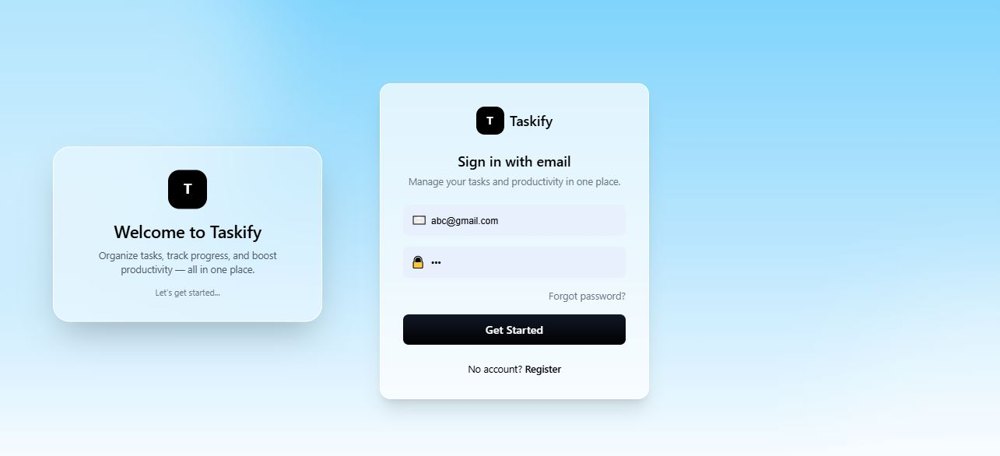
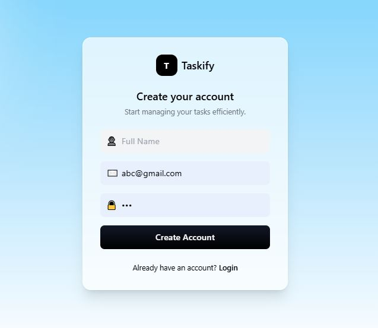
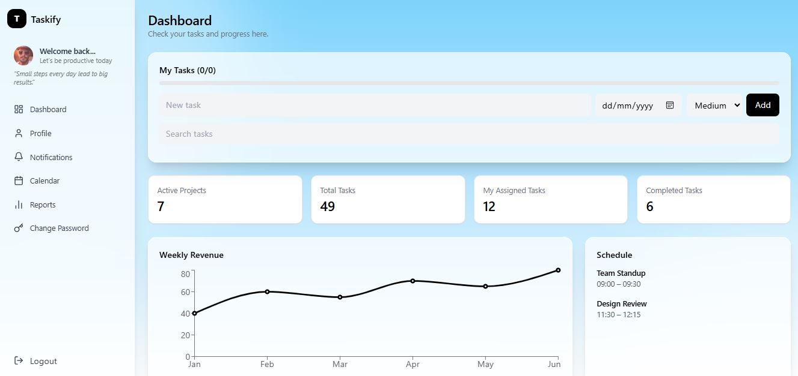
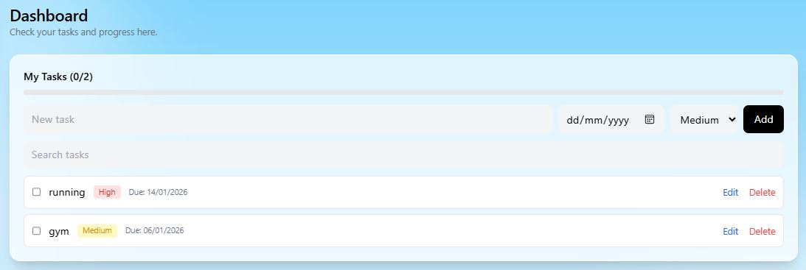
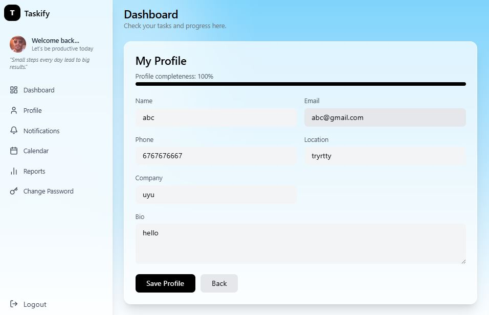
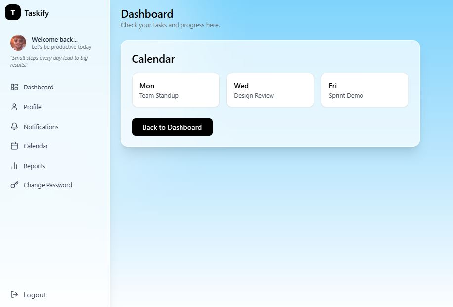
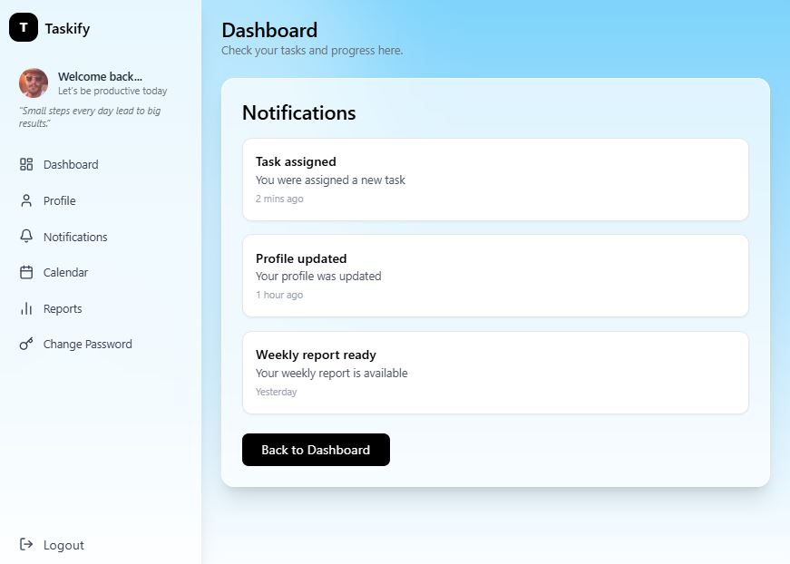
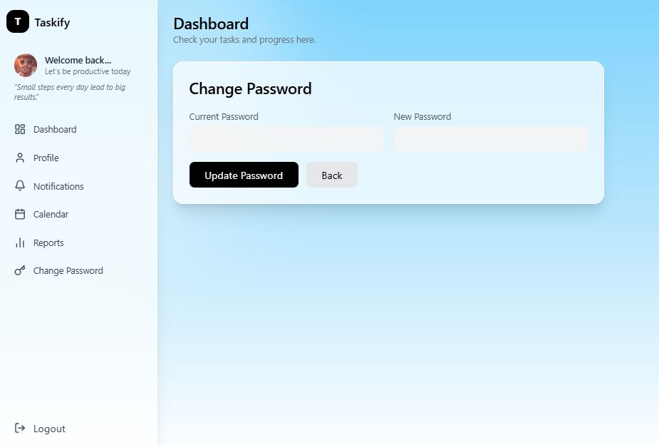
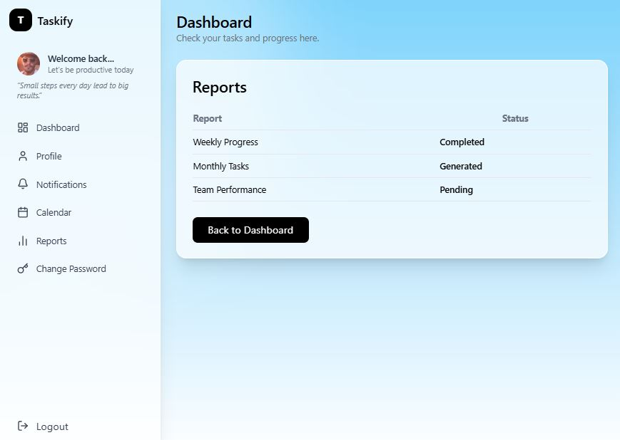

#  Taskify – Full Stack Task Management Dashboard

Taskify is a modern, responsive full-stack task management web application built with React, Node.js, Express, and MongoDB.  
It provides secure authentication, a clean dashboard UI, and powerful task management features.

---

##  Features

###  Authentication
- User Register / Login / Logout
- JWT-based authentication
- Password hashing with bcrypt
- Protected routes for authenticated users

---

###  Dashboard
- Responsive dashboard layout
- Fixed sidebar on desktop, collapsible on mobile
- Task statistics & progress overview
- Interactive charts using Recharts

---

###  Task Management
- Add, edit, delete tasks
- Inline task editing
- Task completion checkbox
- Task priority (Low / Medium / High)
- Task due dates
- Task completion progress bar
- Search & filter tasks
- Drag & drop task reordering
- Auto-updating task counts

---

###  Profile Management
- View & update profile details
- Read-only email field
- Profile completeness indicator
- Form validation
- Toast notifications

---

###  Change Password
- Separate change password section
- Secure password update
- Validation & error handling
- Toast feedback

---

###  Other Sections (UI/Dummy)
- Notifications
- Calendar
- Reports

---

###  UI / UX
- Glassmorphism-based modern UI
- Built with Tailwind CSS
- Fully responsive (mobile, tablet, desktop)
- Smooth animations & transitions
- Clean and consistent design system

---

##  Tech Stack

### Frontend
- React.js
- React Router
- Tailwind CSS
- Recharts
- Lucide Icons
- Axios

### Backend
- Node.js
- Express.js
- MongoDB
- Mongoose
- JWT
- bcrypt

---

## Local Setup & Installation
1. Clone Repository
git clone https://github.com/your-username/taskify.git
cd taskify

2. Backend Setup
cd backend
npm install
npm run dev

3. Frontend Setup
cd frontend
npm install
npm run dev

## API Endpoints
### Authentication

POST /api/auth/register

POST /api/auth/login

GET /api/auth/me

### Tasks

GET /api/tasks

POST /api/tasks

PUT /api/tasks/:id

DELETE /api/tasks/:id

PUT /api/tasks/reorder/all

### User

PUT /api/users/profile

PUT /api/users/change-password

### Security Practices

Password hashing using bcrypt

JWT authentication middleware

Protected API routes

Input validation & centralized error handling

### Scalability Notes

Frontend & backend can be deployed separately

MongoDB Atlas for cloud database

NGINX as reverse proxy

Token refresh strategy

Pagination for large task lists

Docker support for containerization

### Future Enhancements

Task reminders & notifications

Team collaboration

Dark mode

File attachments

Real calendar integration

---

##  Screenshots

###  Authentication

---

###  Dashboard

---

###  Task Management

---

###  Profile & Security

---

### Calendar & Notifications

---

###  Change Password

---

###  Reports

### Author

Sahil Kumar
Full-Stack Developer
Email:sahilkumarr1704@gmail.com

